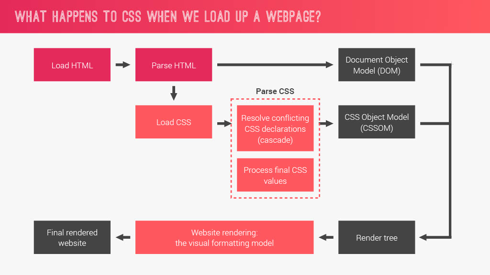

# CSS-Internals

This branch will be focused on how CSS works, and basic information of good-code conventions.

## Fundamental Principles of Writing Good HTML and CSS

| Responsive Design              | Maintainable and Scalable Code | Web Performance                    |
|--------------------------------|--------------------------------|------------------------------------|
| Fluid layouts                  | Clean                          | Less HTTP requests                 |
| Media queries                  | Easy to understand             | Less code                          |
| Responsive images              | Growth                         | Compress code                      |
| Correct units                  | Reusable                       | Use a CSS preprocessor (Like Sass) |
| Desktop-first vs. mobile-first | How to organize files          | Less images                        |
|                                | How to name classes            | Compress images                    |
|                                | How to structure HTML          |                                    |

## How CSS Works Behind the Scenes

```css
.selector {
    property: declared-value;
}

```

### What is Cascade?

Cascade is the process of combining different stylesheets and resolving conflicts between different CSS rules and declarations, when more than one rule applies to a certain element.



### The Visual Formatting Model

The algorithm that calculates boxes and determines the layout of these boxes, for each element in the render tree, in order to determine the final layout of the page.

### The Box Model

- **Content:** text, images, etc.

- **Padding:** transparent area around the content, inside of the box.

- **Border:** goes around the padding and the content.

- **Margin:** space between boxes.

- **Fill Area:** area that gets filled with background color or background image.

**Total Width:** `right border + right padding + specified width + left padding + left border`.

**Total Height:** `top border + top padding + specified height + bottom padding + bottom border`.
